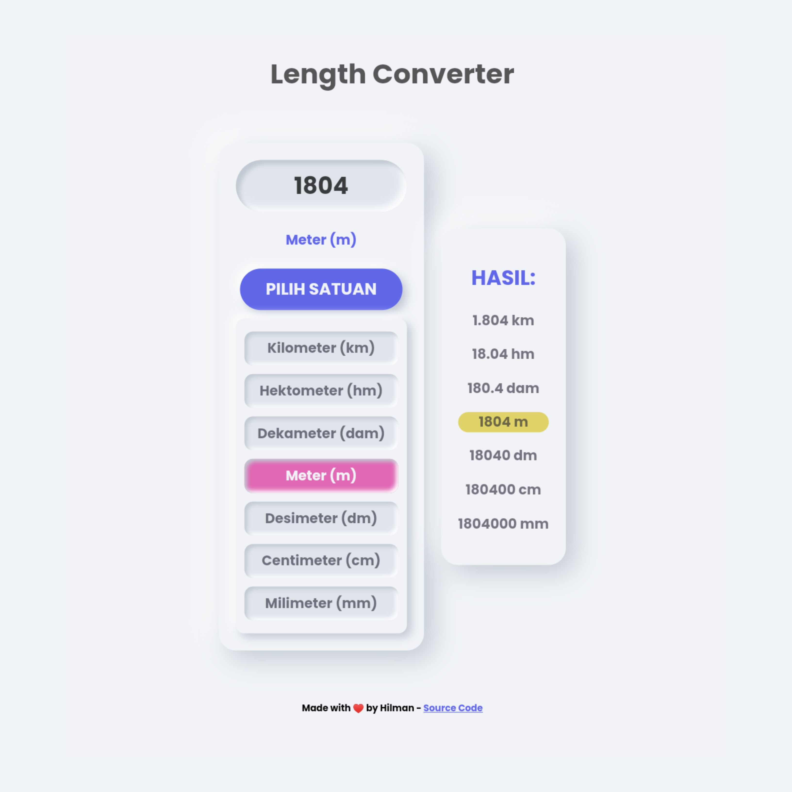

# length-unit-converter
Sebuah tools yang berfungsi untuk mengkonversi satuan panjang :
- Kilometer (km)
- Hektometer (hm) 
- Dekameter (dam)
- Meter (m)
- Desimeter (dm)
- Centimeter (cm)
- Milimeter (mm)

## Preview 

## Demo
[Click me plz](https://hilman-aprdi.github.io/length-unit-converter/)
